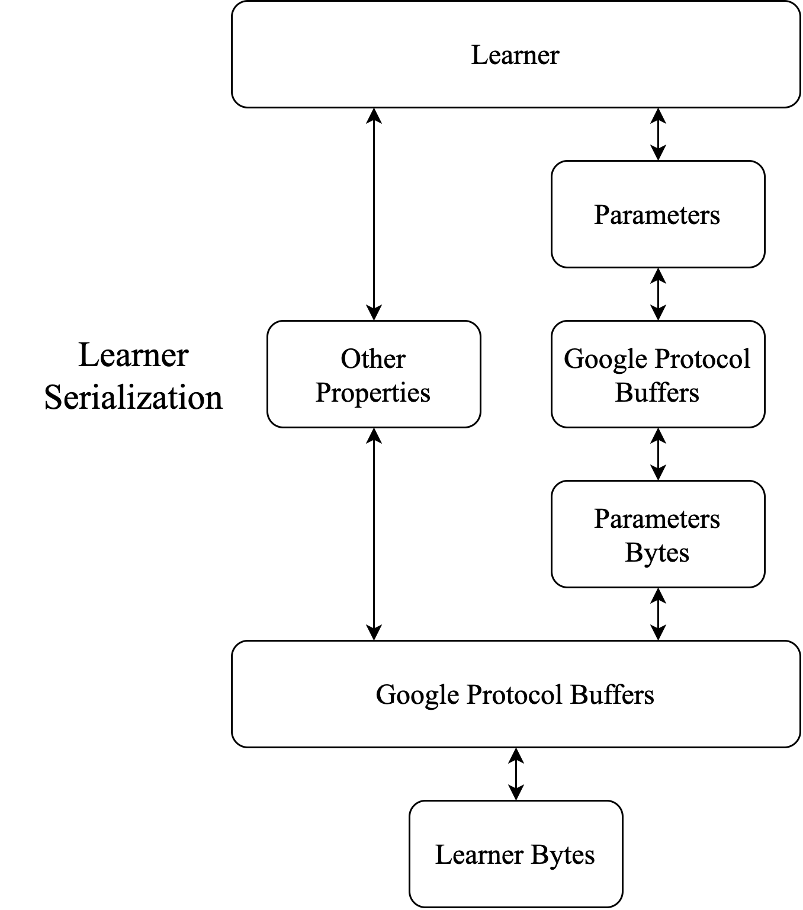

# Drillbit

Drillbit是基于Apache Drill的SQL机器学习系统。

## 系统说明

### Learner

Learner作为所有算法的interface，具有：

- 处理命令行参数的方法，即getOptions、parseOptions、processOptions
- 与Drill UDAF相同的方法供调用，即add、output、reset
- 显示帮助的方法，即showHelp
- 序列化与反序列化的方法，即toByteArray和fromByteArray，只序列化预测需要用到的参数，但不仅仅包括权重。

BaseLearner为Learner的abstract实现。add方法中，首先从字符串中提取Feature的List，然后使用train方法训练。train中调用update方法，根据具体需要来实现。为了实现迭代训练，BaseLearner使用注释给出了具体实现，在output中使用finalizeTraining，finalizeTraining会调用iterativelyTraining。为了实现mini
batch，BaseLearner使用注释给出了具体实现，在update中调用miniBatchUpdate。类似的的还有create optimizer、create
model等。除此之外，BaseLearner还给出了将每个样本的输入写入到文件和从文件读取的方法，供子类调用，无需重写。对使用Model的BaseLearner的子类，需要自行决定WeightType；对使用DecisionTree的BaseLearner的子类，不需要决定WeightType。

BaseLearner的子类有三种：

- GeneralLearner，即命令行参数可以有iters、minibatch、chkcv、optimizer、regularization等，需要将BaseLearner注释的方法全部实现。
-

Abstract的Learner，规定了这一类的子类只能有哪种命令行参数，如不能有optimizer、minibatch等，不需要完全实现BaseLearner注释的方法，比如可以只实现update，update里面不需要miniBatchUpdate就不要实现，在这里就规定了序列化的方法。每一个Abstract的Learner与一个drillbit.protobuf中的message对应，只序列化预测要用到的属性、构建Model需要的dense、dims。在反序列化时，将得到的weights字节串反序列化为Model，权重类型默认为Single，因为只需要作为预测用途，用作继续训练用途则将Model中的Weight进行转换，这将下放到第三种子类中来确定；或将root字节串反序列化为DecisionTree。
-
三是第二种的final子类，重写train、update等方法以实现最终的功能。由于Abstract的Learner的final子类使用权重可能不同，在这里决定WeightType，并且实现从预测模型到可训练模型的转换方法，仅为权重的转换，这一方法由Model提供，默认由Single转化为其他类型，只要传入WeightBuilder即可。

在三种子类中，第一种是final的实现，与第二种是并列的，而第三种是第二种的final实现。

### Feature

特征为name+delimiter+value。对于numerical的feature，deliminater为':'，对于categorical的feature，delimiter为'#'
。在处理时，categorical的feature被转换为numerical，其name为原来的feature string，其value为1.0。

### Weights

ExtendedWeight不仅储存权重，还储存优化或者结果需要的其他参数。因此ExtendedWeight含有一个参数列表，不同的ExtendedWeight根据含有的参数进行区分，而参数的数目可以通过ExtendedWeight进行适应。与Hivemall不相同的是，Hivemall的Weight是根据参数的个数进行区分的，有可能造成混乱。

### Parameter

Model储存权重，分为Dense与Sparse两种。可以针对Weight的类别进行转化。Model有对应的proto进行序列化。在含有Model的Learner序列化时，第一层是序列化Model，第二层是将Model序列化结果作为byte数组，与其他Learner需要的信息进行序列化。在反序列化时这个过程相反。

Tree储存一个Node，Node是决策树的结点。因为Java没有指针，针对Node的序列化与反序列化，我们使用了递归的方式，在序列化时从叶子结点向根节点处理，在反序列化时由根节点向叶子结点处理。

### Protobuf

为Protocol Buffer编译器根据resource/drillbit/protobuf中的proto文件生成。在message中使用repeated nested message而不是map以减少序列化后字节串长度。

proto文件中：

- sample_pb.proto用于序列化和反序列化每一行的输入
- classification_pb.proto用于序列化和反序列化属于classifier的final的Learner子类，在Learner序列化的第一层
- regression_pb.proto用于序列化和反序列化属于regressor的final的Learner子类，在Learner序列化的第一层
- parameter_pb.proto用于序列化和反序列化Model和Decision Tree，作为Learner序列化的第二层

这里其实存在着Protocol Buffer的Java版本中禁止import
message的困难，但是我们可以将Learner的序列化与反序列化从一层变成两层，只使用bytes来表示底层的参数序列化结果，这样更加清晰的同时也符合Learner不与具体参数形式绑定（Model或Node）的想法。参数序列化的流程可参考图1。

protobuf的代码行数较多，但使用非常简单，参考https://developers.google.com/protocol-buffers/docs/javatutorial。

### Metric

Metric是一个interface，由于metric通常是对多个输入产生一个输出，因此Metric含有UDAF相同的方法，即add、output与reset。由于output可能输出double（对于roc-auc等）或字符串（对于confusion
matrix等），因此选择Object作为返回类型。

MetricHelper是一个工作类，分为Binary与Multiclass，其接收double的标签label与预测的分数score，或接收string的标签label与预测的标签predicted作为输入。

### UDF

使用ObjectHolder来在Workspace中包裹Learner的final子类，在setup中new出ObjectHolder，然后设置obj为new出的Learner的final子类，在add中调用子类的add，在output中调用子类的output，在reset中调用子类的reset。在调用子类的方法时，都要先使用类型转换。

对于UDF输出的是NullableVarChar变量，必须设置isSet = 1。

接收命令行参数需要在@Param中指定constant，并且变量类型不能是Nullable。

类型转换时和使用其他类时，都一定要使用类的全名。

设置VarChar变量的值时，一定要使用Inject的Drillbuf来设置。

获取VarChar或者NullableVarChar变量的值时，一定要使用org.apache.drill.exec.expr.fn.impl.StringFunctionHelpers.toStringFromUTF8。

对于Nullable的变量，需要检查isSet是否是1。

## 开发指南

在添加一种机器学习算法时，需要确定以下几点：

- 算法的参数形式，如线性模型为一维向量、决策树模型为二叉树结点、KNN模型为二维数组、GMM为多个一维向量与二维数组（聚类中心与方差矩阵）。
-

算法需要的命令行参数，如迭代次数、损失函数。对于决策树没有迭代次数的选项，对于支持向量机有核函数等选项、对于KNN需要聚类个数等选项，对于GMM需要聚类个数与EM算法判断收敛的阈值等选项。除了训练和超参数，还应该有参数储存形式的选项，如对一维向量，有dense与sparse存储的选项，对二维数组，在dense与sparse之外，还可以选择row
major，column major、crc等方式。此类参数一般不包含输入。

- 实现训练和预测还需要的其他属性，如各个类别的标签，以及重建参数所需的属性，如参数储存形式与大小。

通过实现一个final的Learner来添加这种算法：

1. 继承Learner或合适的abstract
   BaseLearner，根据需要的命令行参数实现getOptions、parseOptions、processOptions、showHelp方法。实现方法参考GeneralClassificationLearner。
2. 根据命令行参数实现add方法与output方法。add方法输入一个样本作为第一、第二个参数和命令行选项作为第三个参数，output方法输出byte
   array作为udf的输出。add方法中需要解析命令行参数，这是udf无法提前获悉命令行参数所做的折中，在解析完后将optionProcessed置位，参考GeneralClassificationLearner。如有需要，add方法中可以使用writeSampleToTempFile将输入存到临时文件中。对需要迭代训练的算法，output方法中进行迭代训练。总之在output方法中根据算法需要完成训练，并且输出learner的序列化结果。实现reset方法，主要清空参数与复位optiomProcessed的标志。
3.

如果不存在相应的参数形式对应的message，则在drillbit/protobuf/parameters_pb.proto中添加，重新编译proto文件；如果存在，则直接使用。目前已有一维向量（及其sparse与dense实现）、决策树根节点、二维数组（及其各种实现）供选择。

4. 在drillbit/protobuf/classification_pb.proto或regression_pb.proto或其他对应包名称_pb.proto的文件中添加final
   Learner的message，在message中包含实现训练和预测还需要的其他属性，以及作为Parameter序列化结果的bytes。
5. 根据图1实现序列化与反序列化的方法fromByteArray与toByteArray。
6. 在drillbit/udfs/中实现对应的UDAF，在UDAF中调用learner的add、output、reset方法。
7. 测试。

## 开发原则与代码规范

主要的开发原则有：

- 隔离原则：
- 123
- 123

代码规范分为两类：major与minor。违反major规范的代码不会被接受，违反minor规范的代码会被建议修改。以下按照类别进行列举。

### 命名

- drillbit.model: 名词，驼峰。major。
- drillbit.udf：驼峰。对于Learner子类对应的UDF，名词 + WithCommandLine / WithoutCommandLine；对于加载数据集，Load + 数据集名称 + WithOptions /
  WithoutOptions；对于Metric，名词，不缩写。udf名称一律从驼峰变为小写+下划线连接。对于输入输出的处理，动词。major。
- drillbit.protobuf：名词，驼峰，后缀Pb，代表Protocol Buffer。内部message：名词，驼峰。major。
- drillbit.classification、drillbit.regression：名词，驼峰，末尾是Learner。major。
- 不同Learner子类的Options：与GeneralRegressionLearner保持相同。major。

### 导入、空行、换行、缩进

-

import分为四个部分；第一部分为drillbit的import，按字母表顺序从a-z排列；第二部分为org.apache的包的import，按字母表顺序从a-z排列；第三部分为其他包的import，按字母表顺序从a-z排列；第四部分为java原生包的import，按字母表顺序从a-z排列。minor。

- import的每个部分之间空一行，内部不空行，最后的import与class之间空一行。minor。
- method之间空一行。minor。
- properties之间分组，组内不空行，组间空一行。minor。
- 每条语句无论多长，均不换行。minor。
- if-else与其他语句之间空一行。minor。
- 变量声明与其他语句之间空一行。minor。
- 缩进为四个空格。major。

### 其他

- 使用ArrayList而不是List。minor。
- 使用ArrayList传递参数而不是数组。minor。
- 使用ConcurrentMap提高性能而不是HashMap。minor。

## 贡献原则

在Fudan-MediaNET未公开代码前不在任何平台传播代码与分享与Drillbit项目有关内容。

